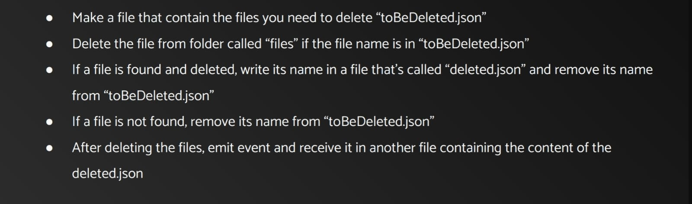

# Lesson 1: Introduction to Node JS

## Introduction to backend

[What’s the Difference Between Frontend and Backend in Application Development?](https://aws.amazon.com/compare/the-difference-between-frontend-and-backend/)

## Request response cycle

The Request-Response Cycle is a fundamental concept in web development, describing the process by which a client (usually a web browser) requests information from a server, and the server responds back with the requested data.

## Intro to NodeJS

Node.js is an open-source and cross-platform JavaScript runtime environment. It is a popular tool for almost any kind of project!

Node.js runs the V8 JavaScript engine, the core of Google Chrome, outside of the browser. This allows Node.js to be very performant.
[Introduction to NodeJS](https://nodejs.org/en/learn/getting-started/introduction-to-nodejs)

## What is CRUD API

In web development, CRUD operations are the bread and butter of backend systems. This is because they allow you to "Create", "Read", "Update", and "Delete" data through your API.

[What's CRUD API?](https://www.freecodecamp.org/news/create-crud-api-project/#what-is-a-crud-api)

## http Protocol

What is HTTP?
The Hypertext Transfer Protocol (HTTP) is designed to enable communications between clients and servers.
HTTP works as a request-response protocol between a client and server.

[HTTP Methods](https://www.w3schools.com/tags/ref_httpmethods.asp)

## Local Modules in NodeJS

Node.js comes with different predefined modules (e.g. http, fs, path, etc.) that we use and scale our project. We can define modules locally as Local Module. It consists of different functions declared inside a JavaScript object and we reuse them according to the requirement. We can also package it and distribute it using NPM. 

[Node.js Local Module](https://www.geeksforgeeks.org/node-js-local-module/)

## Built-in modules

Node.js has a set of built-in modules which you can use without any further installation.
[Node JS Built-in modules](https://www.w3schools.com/nodejs/ref_modules.asp)

## Modules scope

[Global Scope and module scope ](https://medium.com/nerd-for-tech/module-in-nodejs-95eba74e352f)

## Modules cashing

[Node.js Module Caching](https://medium.com/@mackplevine/node-js-module-caching-10c4e395423e)

## fs module

The fs module provides a lot of functionality for interacting with the file system. Some of the more common functions that you will use are writeFile() / writeFileSync() and readFile() / readFileSync(). These functions let you write to and read from files, respectively.
[fs module in Node.js](https://blog.risingstack.com/fs-module-in-node-js/)

## Node JS Path Module

[Path Module](https://www.geeksforgeeks.org/node-js-path-module-complete-reference/)

## Events module (EventEmitter)

[Node Event Emitters](https://medium.com/developers-arena/nodejs-event-emitters-for-beginners-and-for-experts-591e3368fdd2)

## Assignment 

