# Lesson 2: Introduction to Node JS

## Asynchronous Code Execution in Node.js 

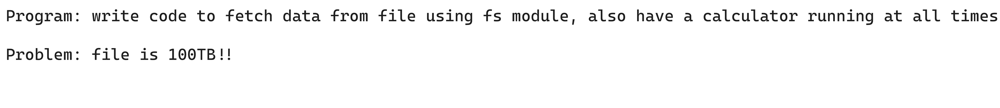

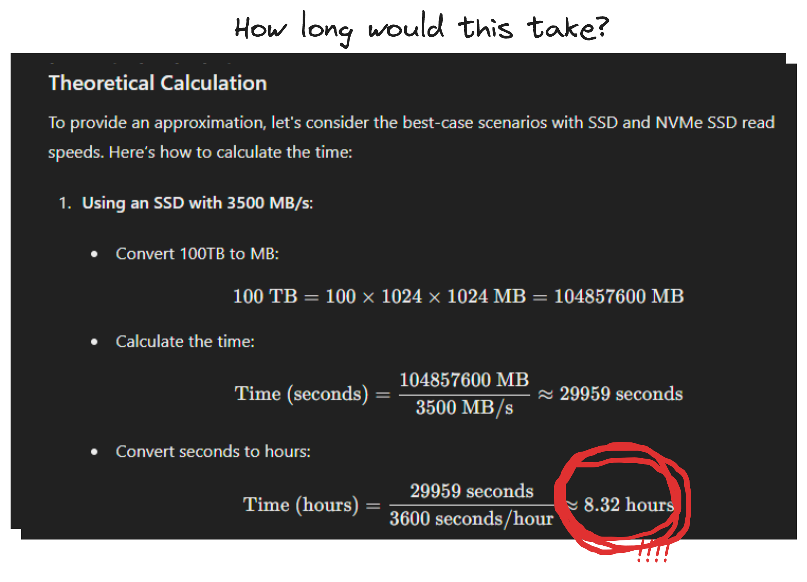

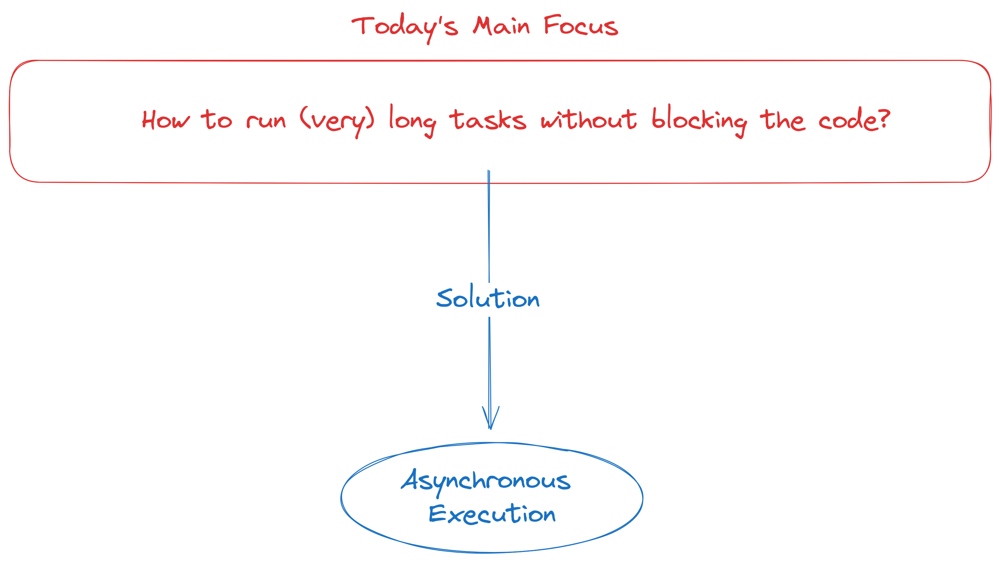

## Synchronous VS Asynchronous

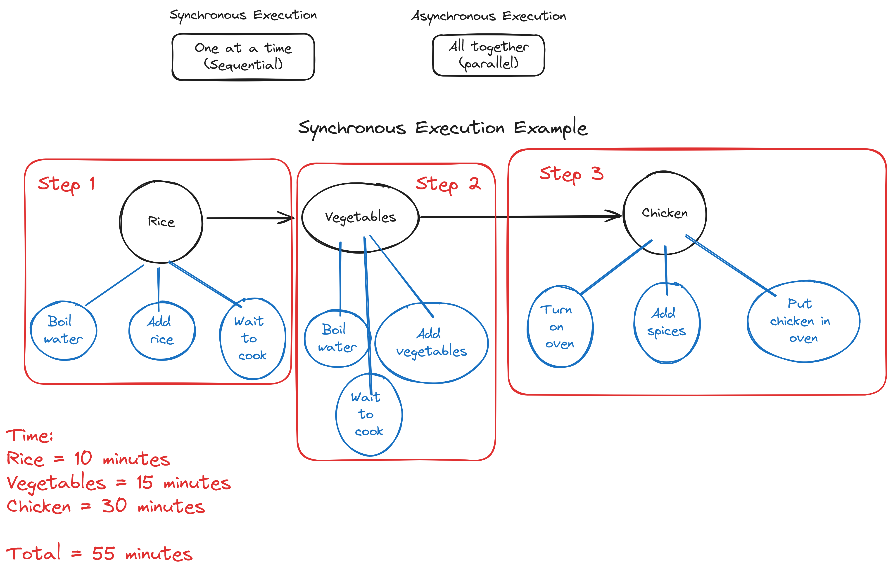

## Asynchronous execution example

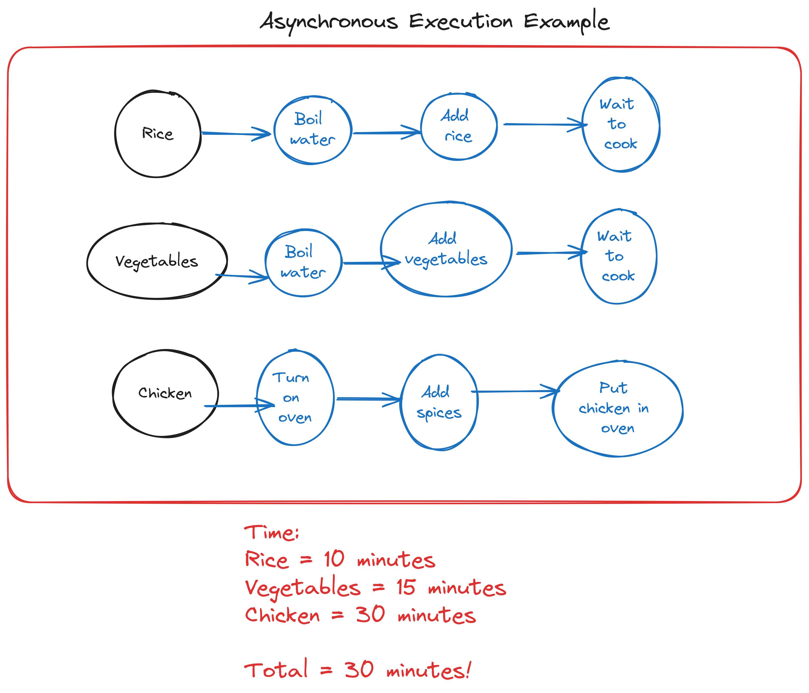

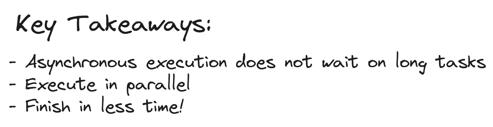

## V8 Engine

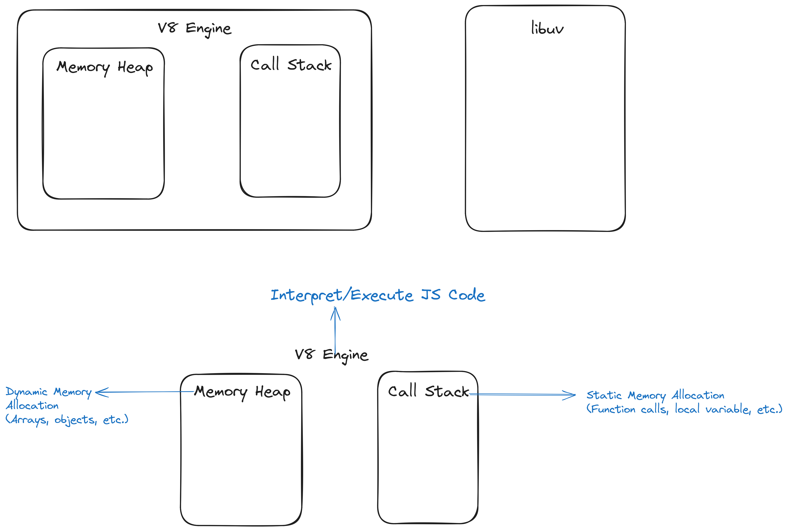

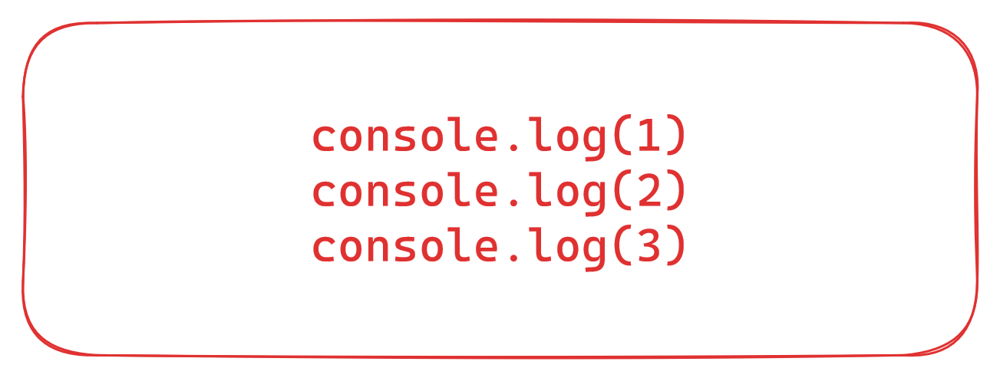

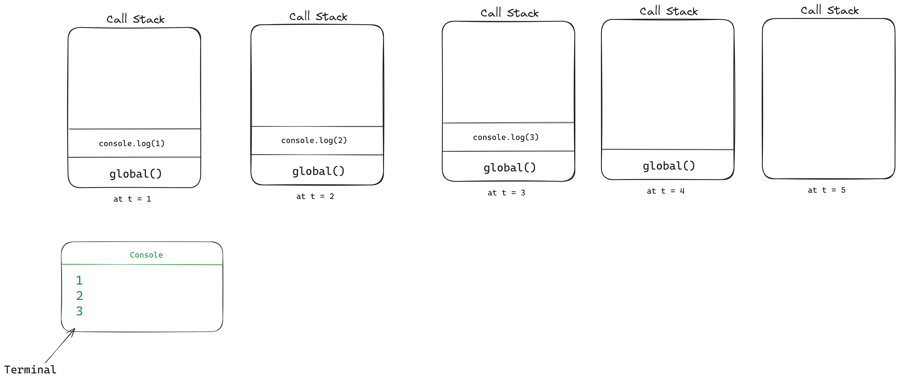

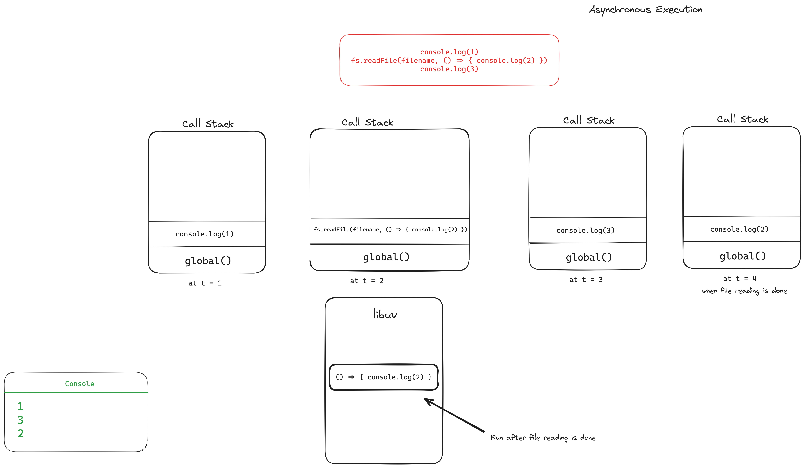

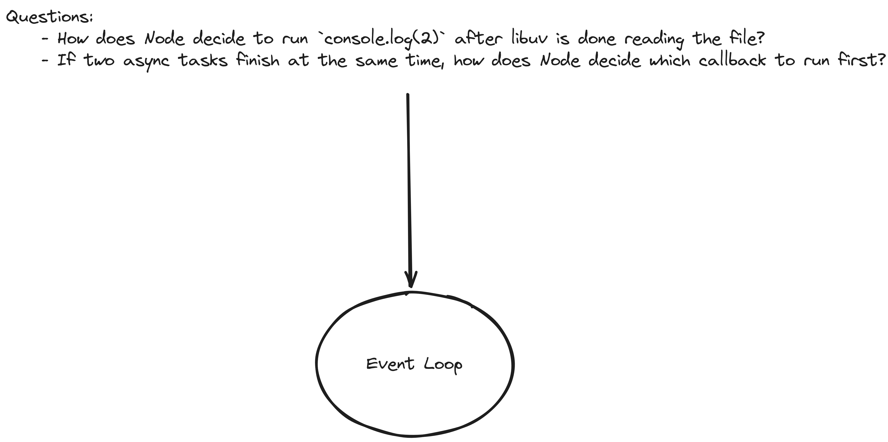

## Event Loop

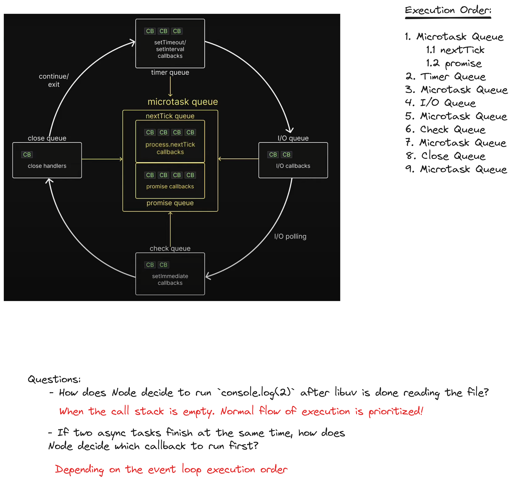

## Additional Readings

- [How does the internet work?](https://cs.fyi/guide/how-does-internet-work)
- [Server-Client Architecture](https://developer.mozilla.org/en-US/docs/Learn/Common_questions/Web_mechanics/What_is_a_web_server)
- [HTTP Overview](https://developer.mozilla.org/en-US/docs/Web/HTTP/Overview)
- [HTTP Messages](https://developer.mozilla.org/en-US/docs/Web/HTTP/Messages)
- [What is HTTP? in depth](https://cs.fyi/guide/http-in-depth)
- [What is a Domain Name?](https://developer.mozilla.org/en-US/docs/Learn/Common_questions/Web_mechanics/What_is_a_domain_name)
- [What is the difference between webpage, website, web server, and search engine?](https://developer.mozilla.org/en-US/docs/Learn/Common_questions/Web_mechanics/Pages_sites_servers_and_search_engines)
- [What is DNS and how it works?](https://www.youtube.com/watch?v=Wj0od2ag5sk)
- [Event Loop - Codevolution channel](https://www.youtube.com/watch?v=L18RHG2DwwA&list=PLC3y8-rFHvwh8shCMHFA5kWxD9PaPwxaY&index=43)
- [Codevolution YouTube channel](https://www.youtube.com/@Codevolution)
