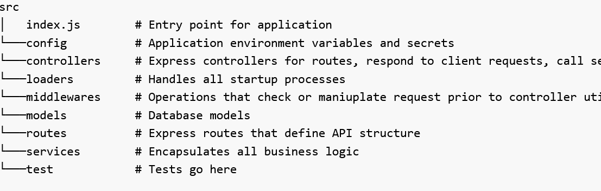

# Lesson 3: Introduction to express

## What is Express?

Express is a Web Framework built upon Node.js.

Node.js is an amazing tool for building networking services and applications.

Express builds on top of its features to provide easy to use functionality that satisfies the needs of the Web Server use-case. It's Open Source, free, easy to extend, and very performant.

There are also lots and lots of pre-built packages you can just drop in and use to do all kinds of things.

## SOA (Service-Oriented Architecture):

In the context of a monolithic application can be understood as a way to organize the structure of your app to make it more modular and maintainable. The key components of SOA in this context are the Controller, Service, and Data Access layers. Let's break each one down:

### 1. *Controller Layer*:
   - The controller is the entry point for handling user requests. Imagine it as a receptionist in a large office who greets you and directs you to the right department based on your needs.
   - In a monolithic app, controllers handle HTTP requests, process input, and determine which service to call to fulfill the request.
   - Example: When you visit a URL to see your profile, the controller for the profile might be something like ProfileController. It takes your request, maybe checks your credentials, and then calls the service to get your profile data.

### 2. *Service Layer*:
   - Services contain the business logic of your application. Think of them as the different departments in the office that actually do the work.
   - They take the input from the controllers, process it according to the business rules, and may interact with the data access layer to fetch or store data.
   - Example: The ProfileService would have methods to get your profile details, update your profile information, etc. It ensures all the business rules are followed when performing these actions.

### 3. *Data Access Layer (DAL)*:
   - The Data Access Layer is responsible for interacting with the database. It's like the storage department that handles all the documents and files.
   - It provides methods to create, read, update, and delete data in the database without exposing the database details to the other layers.
   - Example: The ProfileRepository or ProfileDAO (Data Access Object) would have methods to get profile data from the database, save new profile information, and so on.

### Putting It All Together:

1. *User Request: When a user sends a request (like accessing their profile), it first hits the **Controller*.
2. *Controller Processing: The controller processes the request, checks for necessary parameters or authentication, and then calls the appropriate **Service* method.
3. *Service Logic: The service handles the business logic. If it needs data from the database, it calls the **Data Access Layer*.
4. *Data Access: The Data Access Layer interacts with the database, performs the required operations (like fetching user data), and returns the results to the **Service*.
5. *Response: The service processes the data (if needed) and sends it back to the **Controller*, which then forms the final response to the user.

### Why This Structure?

- *Separation of Concerns*: Each layer has a specific role, making the app easier to manage and understand.
- *Maintainability*: Changes in one part of the app (e.g., database changes) don’t require changes in the business logic or the way requests are handled.
- *Reusability*: Business logic in the service layer can be reused across different controllers.

By organizing your application in this way, you ensure that each part of your code has a clear responsibility, making your application more organized and easier to maintain.

## Additional Readings

### Express tutorial - https://www.tutorialspoint.com/expressjs/index.htm

### Express handbook - https://www.freecodecamp.org/news/the-express-handbook/

### Express Guide - https://masteringbackend.com/posts/expressjs-5-tutorial-the-ultimate-guide

### SOA - https://www.codementor.io/@evanbechtol/node-service-oriented-architecture-12vjt9zs9i

### Express Crash Course by Traversy Media Youtube channel - https://youtu.be/CnH3kAXSrmU?t=2073

## Assignment 

**Full-Day Task: Building a Simple Movie Management API**

### Objective
Create a backend server that manages movie data using Express.js. This project will guide you through understanding and applying Service-Oriented Architecture (SOA) principles to build a robust and maintainable API.

### Project Structure
The project will be organized to follow best practices in separating concerns, ensuring that each part of the application has a specific role and responsibility. The key components will include:
- **Controllers**: Handle the HTTP requests and responses.
- **Services**: Encapsulate the business logic.
- **Middlewares**: Process requests before they reach the controllers.
- **Models**: Represent the data and handle data operations.
- **Routes**: Define the API endpoints.

### Step-by-Step Guide
#### 1. Define the Objective
You will create an API that allows users to manage movie data. The API will support the following operations:
- Retrieve a list of all movies
- Retrieve details of a specific movie by ID
- Add a new movie
- Update an existing movie
- Delete a movie

#### 2. Apply Service-Oriented Architecture (SOA)
Service-Oriented Architecture (SOA) is a design principle where your application is organized into services. Each service is responsible for a specific piece of functionality. In this project, you'll separate the application into different layers to achieve modularity and maintainability.

#### 3. Structure Your Application
Your application will have the following key components:
- **Controllers**: Handle incoming HTTP requests and send responses back to the client. They will delegate the actual processing to services.
- **Services**: Contain the business logic. Controllers will call these services to perform actions like fetching data, updating data, etc.
- **Middlewares**: Functions that process requests before they reach the controllers. Common examples include logging, authentication, and error handling.
- **Models**: Represent the movie data and handle data operations like reading from and writing to data storage.
- **Routes**: Define the URL endpoints for your API and map them to the corresponding controller functions.
- **DAL/Repos**: Handle database connections and operations (mock data).

#### 4. Implement the Features
For each feature, consider the following steps:
1. **Routes**: Define the API endpoints.
2. **Controllers**: Implement the functions that will be called when these endpoints are hit.
3. **Services**: Write the business logic that the controllers will call.
4. **Models**: Manage the movie data.

#### 5. Consider Middleware
Middleware functions can enhance your API by adding common processing steps for requests. Examples include:
- **Logging**: Keep track of API calls for debugging and monitoring.
- **Error Handling**: Standardize how errors are managed and returned to the client.

### Deliverables
By the end of the task, you should have a fully functional Movie Management API with:
- A well-structured codebase following SOA principles.
- Routes to handle CRUD operations for movies.
- Controllers that manage request and response flows.
- Services encapsulating the business logic.
- Middleware for logging and error handling.
- Models to represent and manage movie data.
- DAL/Repos containing database connection and operations (mock data).

